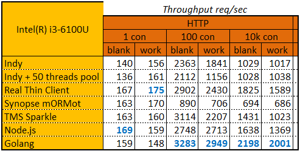

### NetBenchmarks

**ENG:**

This project was started because I and a few friends had a desire to develop our own high-performance networking library. Unfortunately, there was not enough free time, and Delphi is losing its popularity more and more, so the development had to be temporarily suspended. One of the key ideas, to make a comparative table of the performance of different network solutions, seemed to me very interesting, therefore, as soon as I managed to measure the performance of the first protocol, I immediately posted the benchmarks for free access. The project is completely open source, so you can freely add libraries and protocols to benchmarks by submitting them to Pool Requests, or make your own forks.

The central idea of ​​the benchmarks is that, in addition to hardware, there are 3 key factors that affect the performance of network solutions: protocol, connection management and memory management. Benchmarks measure the load on different protocols, number of connections and useful work options. The blank option does not do any useful work, so in theory it should give the maximum result. The work option accepts a JSON document from the request, parses it, processes it, and sends the resulting JSON document in response. The payload factor is important in benchmarks because most memory managers use thread locks - which is not at all obvious and can have an extremely negative effect on the performance of a network solution. The results table lists the maximum performance indicators for several benchmark runs.

**РУС:**

Данный проект был начат потому, что у меня и нескольких товарищей было желание разработать собственную высокопроизводительную сетевую библиотеку. К сожалению, свободного времени было мало, а Delphi всё больше теряет популярность – поэтому пришлось временно приостановить разработку. Одна из ключевых идей, сделать сравнительную таблицу производительности разных сетевых решений, - мне показалась очень интересной, поэтому, как только удалось замерить производительность первого протокола – я сразу же выложил бенчмарки в свободный доступ. Проект является полностью открытым, поэтому вы можете свободно добавлять библиотеки и протоколы в бенчмарки, отправляя их в Пул Реквестах, или делать собственные форки.

Центральная идея бенчмарков заключается в том, что кроме аппаратного обеспечения есть 3 ключевых фактора, влияющих на производительность сетевых решений: протокол, менеджмент соединений и управление памятью. Бенчмарки замеряются нагрузку на разных протоколах, количествах соединений и вариантах полезной работы. Вариант blank не выполняет никакой полезной работы, поэтому в теории должен выдавать максимальный результат. Вариант work принимает JSON-документ из запроса, парсит его, обрабатывает, и отправляет результирующий JSON-документ в ответ. Фактор полезной работы важен в бенчмарках потому, что большинство менеджеров памяти используют блокировки потоков – что совсем не очевидно и крайне негативно может сказаться на производительности сетевого решения. В таблицу результатов вносятся показатели максимальной производительности за несколько запусков бенчмарков.